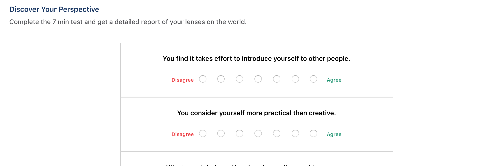
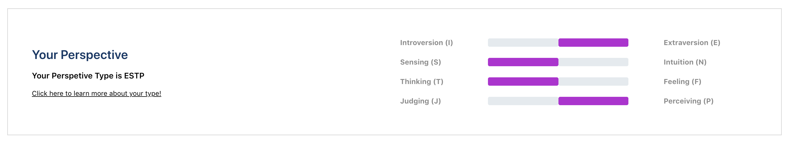

# Perspective App
Perspective is a short 10 question MBTI that will identify your personality type!

The technlogies used to create Perspective include: React, PostgresSQL, Ruby on Rails, HTML5, and CSS3.

You can take the quiz [here](https://perspective-shift.herokuapp.com)! Or visit my portfolio site [here](http://www.davidyoon.me/#home)!

